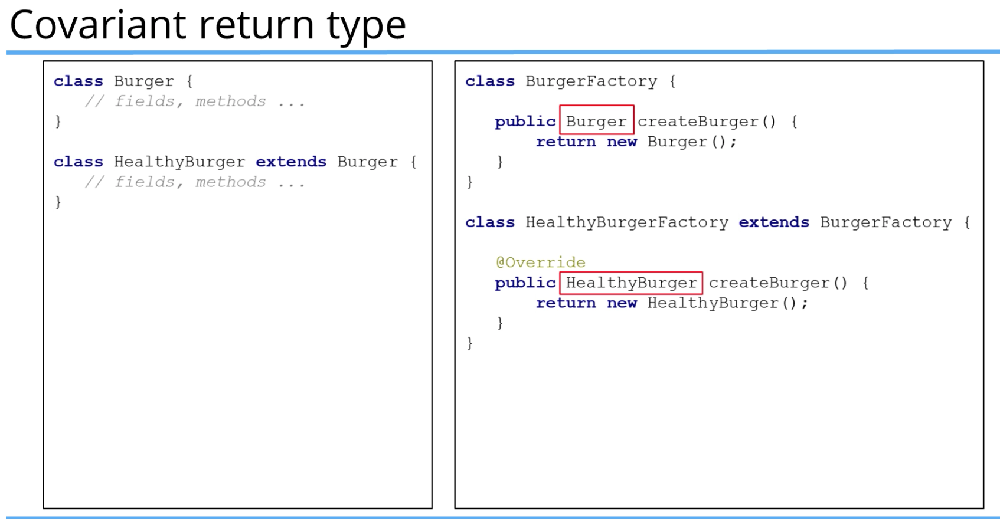

# Java-Learning
- To download prebuilt OpenJDK binaries for free: https://adoptopenjdk.net/
- There are two JVMs: HotSpot and OpenJ9.
- There are different distributors of OpenJKD:
  - Amazon Corretto
  - Oracle
  - Azul
  - RedHat
- `String` is a class in Java and default value of `null`.
- Constructors can be overloaded. We can define more than one constructor for a class.
- We can call a constructor within another constructor. One example would be that if a constructor with an empty variables is called, we want to call the second constructor with params and set initial/default value for it params instead. We do it by calling `this(val1, val2, ...)` with default values for params (inputs to other constructors with params):
```java
public class BankAccount{

  public BankAccount() {
    this("123234", "345.23", "Bob");
    System.out.println("An empty constructor is called!");
  };
  
  public BankAccount(String account, double balance, String customerName) { 
      System.out.println("Constructor with params is called!");
  }
}
```
- That `this` has to be the first line in the constructor in order to work and to refer to another constructor.
- If you run those line, the output:
```shell
Constructor with params is called!
An empty constructor is called!
```
it first calls the emtpy constructor which first line is a call to the second constructor.

- If we want to default only a subset of params in constructor and not all, we can again use `this`:
```java
public class BankAccount {
  public BankAccount(String customerName, String email, String phoneNumber) {
    this("99999", 100, customerName, email, phoneNumber);
  }

  public BankAccount(String account, double balance, String customerName) {
    System.out.println("Constructor with params is called!");
  }
}
```

- Generally we have one major constructor that update all the fields and then other constructors should call that major constructor.

- There are two opinions on how to set the constructor values to the fields in a class:
  1. set the value directly to the field: ```this.name = name```
  2. use a setter: ```setName(name);```;
  
  the first approach is preferred because it always works in case of ingeritance and subclassing.


- When a Class `extend` another one (inherits from another one), we need to call the constructor of another class for initialization.
- `super` is to call the constructor of the class that we're extending from. SO we can initialize the base class.
```java
 public class Dog extends Animal {
  // Unique characteristic of Dog class apart from Animal base class
  private int eyes;
  private int legs;
  private int tail;
  private int teeth;
  private String coat;
  
  public Dog(int brain, int body, int size, int weight, String name) {
    super(brain, body, size, weight, name);
  }
}
```
- Since the Dog class also has params need to be initialized in additon to those from Animal class, we can remove some of base class params from Dog constructor input and pass in some default values to the base class instead:
```java
 public class Dog extends Animal {
  // Unique characteristic of Dog class apart from Animal base class
  private int eyes;
  private int legs;
  private int tail;
  private int teeth;
  private String coat;
  
  public Dog(int size, int weight, String name, int eyes, int legs, int tail, int teeth, String coat) {
    super(1, 1, size, weight, name);

    this.eyes = eyes;
    this.legs = legs;
    this.tail = tail;
    this.teeth = teeth;
    this.coat = coat;
  }
}
```

- In Dog class, we can use `Override methods...` to override methods available from base class for our child/Dog class.
- `java.lang.Object` Every single class that we create, even though it doesn't come up and show you via the use of `extends` keyword, it does actually get extended from this Java class: `java.lang.Object`.

- we can directly call a Base class method in the child class:
```java
public class Animal{
    //...
    public void move(int speed){
      System.out.println("Animal is moving at: " + speed);
    }
}

public class Dog extends Animal{
    // ...
    public void walk(){
      System.out.println("Dog.walk() is called");
      move(5);
    }
}
```
- If we use `super.move(4)` instead of `move(5)` in Dog class. We need to create some unique characteristic for Dog in move. We see that in `run` method, we don't use `super.move()` and just `move` and since we defined `move` method in Dog class now, it first tried to find the method within the class and if it doesn't it goes to run the superclass one:
```java
- public class Animal{
  //...
  public void move(int speed){
    System.out.println("Animal is moving at: " + speed);
  }
}

public class Dog extends Animal{
  // ...
  public void walk() {
    System.out.println("Dog.walk() is called");
    super.move(5);
  }

  public void run(){
    System.out.println("Dog.run() is called");
    move(10);
  }

  private void moveLegs(int speed){
    System.out.println("Dog.moveLegs() is called");
  }

  @Override
  public void move(int speed) {
    System.out.println("Dog.move() called.");
    moveLegs(speed);
    super.move(speed);
  }
}

//dog.run();
/* output order:
 * Dog.run() is called
Dog.move() called.
Dog.moveLegs() is called
Animal is moving at: 10
 * */
```
- if we comment out the `@Override` code to remove `move` method from Dog class and rerun, we see that it now runs `move` method from super:
`Dog.run() is called
  Animal is moving at: 10`
- In Java, we always have references to objects in memory and we can reference or dereference them by assigning a reference to a new object.

- `this` vs `super`: 
  - `this` is used to access/call the current class members (variables and methods)
  - `super` is used to access/call the parent class members (variables or methods)
  - We can use both of them anywhere in a class except **static areas(static methods of static blocks)**.

- `this` is commonly used with **constructors** and **setters** and optionally for **getters** (easier for beginners).
```java
class House {
    private String color;
    
    public House(String color){
        // this keyword is required
      this.color = color;
    }
    
    public String getColor(){
        // this is optional
      return color; // similar as this.color
    }
    
    public void setColor(String color){
        // this is required.
      this.color = color;
    }
}
```

- `super` is commonly used with **method overriding**, when we call a method with the same name from the parent class.

```java
class SuperClass {
  public void printMethod() {
    System.out.println("Printed in Superclass");
  }
}

  class SubClass extends SuperClass {
    // Overrides method from parent
    @Override
    public void printMethod() {
      super.printMethod(); // calls method in SuperClass
      System.out.println("Printed in SubClass");
    }
  }
  
  class MainClass{
    public static void main(String[] args){
        SubClass s = new SubClass();
        s.printMethod();
    }
  }
```

### this() vs. super() method calls
- Use `this()` to call a constructor from another overloaded constructor in the same class.
- The call to `this()` can be **used only in a constructor, and it must be the first statement in a constructor**.
- it's uses with constructor chaining, when one constructor calls another constructor and helps to reduce duplicated code.

- **In constructor chaining, always one constructor is responsible for initialization variables and does all the work. The other constructors make calls to other ones.**

- **The only way to call a parent constructor is by calling `super()`. This calls the parent constructor**
- The Java Compiler puts a **default call to `super()`** if we don't add it, and it's always the no-args `super` which is inserted by compiler.
- **The call to `super()` must be the first statement in each constructor.**
- Even **Abstract classes** have constructors, although you can never instantiate an abstract class using `new` keyword.
- An Abstract class is still a `super` class, so its constructors run when someone makes an instance of a concrete subclass.
- **A constructor can have a call to `super()` or `this()` but never both.**

### super() and this() example
- In `Rectangle` the first constructor makes call to the second constructor. 
- The second constructor makes call to parent constructor with params x and y. 
- The parent constructor will initialize x, y variables while the second `Rectangle` constructor will initialize the width and height variables.

```java
class Shape {
  private int x, y;

  public Shape(int x, int y) {
    this.x = x;
    this.y = y;
  }
}

class Rectangle extends Shape {
  private int width, height;

  // 1st constructor
  public Rectangle(int x, int y) {
    this(x, y, 0, 0); // calls 2nd constructor
  }

  // 2nd constructor
  public Rectangle(int x, int y, int width, int height){
      super(x, y); // calls constructor from parent 
    this.height = height;
    this.width = width;
  }
}
```

## Method Overloading vs Method Overriding

### 1. Method Overloading
- it means providing two or more separate methods in a class with the **same name but different parameters**.
- Method return type **may or may not be different** and that allows us to **reuse** the same method name.
- Overloading is very handy, it reduces duplicated code and we don't have to remember multiple names.

- Overloading does not have anything to do with **polymorphism** but Java developers often refer to overloading as **Compile Time Polymorphism**.
- In another words, the compile decided which method is going to be called based on the method name, return type and argument list.
- We **can overload static and instance methods**.

- Usually overloading happens inside a single class but a method can also be treated as overloaded in the subclass of that class.
- That is because a **subclass inherits** one version of the method from the parent class and then the subclass can have another overloaded version of the method.

### 1.2. Method Overloading Rules

- Methods will be considered overloaded if both follow the following rules:
  - Methods must have the same method name.
  - Methods must have different parameters.
- If methods follow the rules above then they may or may not:
  - Have different return types
  - Have different access modifiers (`Default, Private, Protected, Public`)
  - Throw different checked or unchecked execeptions.

### 2. Method Overriding
- Method overriding means defining a method in a child class that already exists in the parent class with **the same signature (same name, same arguments)**
- by extending parent class, the child class gets all the methods defined in the parent class (those methods are also known as derived methods).

- Method overriding is also known as **Runtime Polymorphism** and **Dynamic Method Dispatch**, because the method that is going to be called is decided at runtime by the JVM.

- **We can't override static methods. Only instance methods.**

### 2.2. Method Overriding Rules
- Method will be considered overriden if we follow these rules:
  - It must have same name and same arguments
  - Return type can be a sublass of the return type in the parent class.
  - It can't have a lower access modifier.
  - For example if the parent method is protected then using private in the child is not allowed but using public in the child would be allowed.

## 2.3 Method Overriding important points
- **Only inherited methods can be overriden**, meaning methods can be overriden only in child classes.
- **Constructors and private methods cannot be overriden.**
- Methods that are final cannot be overriden.
- A subclass can use `super.methodName()` to call the superclass version of an overriden method.

- **we can overload static methods but we cannot override static methods.**

- Covariant return type, means that the Overriden method can return any child type of the parent method type:


## Static Methods vs. Instance Methods
### 1. Static Methods
- Static methods are declared using a `static` modifier.
- **Static methods can't access instance methods and instance variables directly**
- They are usually used for **operations that don't require any data from an instance of the class (from `this`)**. (`this` is the current instance of a class).

- In static methods we cannot use the `this` keyword.
- Whenever you see a method that **does not use instance variables** that method should be declared as a **static method**.
- For example `main` is a static method and it is called by JVM when it starts an application.
- 

### 2. Instance Methods
- Instance methods belong to an instance of a class.
- To use an instance method, we have to instantiate the class first usually by using the `new` keyword.
- Instance methods can access instance methods and instance variables directly.
- Instance methods can also access **static methods and static variables directly**.


## Static Variables vs Instance Variables
- Declared by using the keyword `static`.
- Static variables are also known as `static member variables`
- Every instance of that class **shares the same static variable**.
- **If changes are made to that variable, all other instacens will see the effect of the change.**
- Static variables are not used very often but can sometimes be very useful.
- For example when reading user input using `Scanner` we will declare scanner as a static variable.
- That way **static methods can access it directly.**
  

- **Instance variables represent the state of an instance.**

## Composition
- **Inheritance is a "IS" relationship**. For example, Car (class) IS a Vehicle (parent class).
- **Composition is a "HAS" relationship.** For example, Car (class) HAS steering wheel (another class), HAS Engine (another class) etc.
- With Inheritace (`extend`), we can only inherit from one class at a time but with composition we can use HAS relationship and use many classes within a class.
- For example, Monitor class Has a Resolution but it IS NOT Resolution:
```java
public class Monitor {
  private String model;
  private String manufacturer;
  private int size;
  private Resolution nativeResolution;
  //
}
```

- PC has Monitor, Motherboard and Case:
```java
public class PC {
    private Motherboard motherboard;
    private Case TheCase;
    private Monitor monitor;

    // constructor receives objects of those class types
    public PC(Motherboard motherboard, Case theCase, Monitor monitor) {
        this.motherboard = motherboard;
        TheCase = theCase;
        this.monitor = monitor;
    }

    // getters return object of that class
    public Motherboard getMotherboard() {
        return motherboard;
    }

    public Case getTheCase() {
        return TheCase;
    }

    public Monitor getMonitor() {
        return monitor;
    }
}
```
- In order to access a method from a class:
```java
public class Main {

    public static void main(String[] args) {
        Motherboard motherboard = new Motherboard("X12", "someManufacturer", 4, 5, "BIOX");

        Case myCase = new Case("model", "man", "power", new Dimensions(23, 10, 5));

        Monitor monitor = new Monitor("model", "man", 23, new Resolution(33, 22));

	    PC myPc = new PC(motherboard, myCase, monitor);

        // To access a method of a class
        myPc.getMonitor().drawPixelAt(22, 25, "Blue");
        myPc.getMotherboard().loadProgram("Star War!");
    }
}
```
- But we don't want to define those method to access classes public so our `Main` class won't have access to those. So we change access pattern from `public` to `private` in our `PC` class and instead define public methods there to make call to other class instances or just get rid of those getters instead:
```java
public class PC {
  private Motherboard motherboard;
  private Case TheCase;
  private Monitor monitor;

  public PC(Motherboard motherboard, Case theCase, Monitor monitor) {
    this.motherboard = motherboard;
    TheCase = theCase;
    this.monitor = monitor;
  }

  public void powerUp() {
    TheCase.pressPower();
    drawLogo();
  }

  public void drawLogo() {
    // Fancy graphics
    monitor.drawPixelAt(1200, 50, "yellow");
  }
}

public class Main {

  public static void main(String[] args) {
    Motherboard motherboard = new Motherboard("X12", "someManufacturer", 4, 5, "BIOX");
    Case myCase = new Case("model", "man", "power", new Dimensions(23, 10, 5));
    Monitor monitor = new Monitor("model", "man", 23, new Resolution(33, 22));
    PC myPc = new PC(motherboard, myCase, monitor);

    // To access a method of a class
    myPc.powerUp();
  }
}
```
## Encapsulation
- By defining a constructor, we can add validations on each field and also set an initial values for the fields. So this way, we make sure that when the object is instantiated, the fields have valid values.
- Also with a `getter` we can restrict access to the fields of a class.

## Polymorphism
1. Compile time/Static Polymorphism: method Overloading
2. Runtime/Dynamic Polymorphism: method Overriding

- In Java to get a class name within its methods we can use `getClass().getSimpleName()`

## Arrays
```java
public class Main {
  public static void main(String[] args) {
    // Approach 1
    int[] myVariable;
    myVariable = new int[10];

    // Approach 2
    double[] myVar2 = new double[20];

    // Approach 3
    int[] myVar3 = {1,2,3,4,5,6};
    
    // Length of an array
    myVariable.length

  }
  
 // To get inputs from users and save them in an array
 //For example, this code allows a user to read a number from System.in:
 private static Scanner scanner = new Scanner(System.in);

    /*
    * As another example, this code allows long types to be assigned from entries in a file myNumbers:

      Scanner sc = new Scanner(new File("myNumbers"));
      while (sc.hasNextLong()) {
          long aLong = sc.nextLong();
      }
    * */

  public static int[] getIntegers(int number){
    System.out.println("Enter " + number + " integer values.\r");
    int[] values = new int[number];

    for (int i=0; i < values.length; i++){
      values[i] = scanner.nextInt();
    }

    return values;
    
  }
}
```
- To print contents of an array (since it's an object): `Arrays.toString(arr)`
- To make sure the returned type is `double` and not `int`, type casting: `(double) sum / (double) arr.length`
- To make a copy of an array instead of a `for` loop: `int[] sortedArr = Arrays.copyOf(arr, arr.length);`
- For **boolean** array elements are initialized to **False**.
- For **string or other objects** that would be **null**.

## Reference Types vs Value Types
- Primitives like `int`, `double` and `boolean` have Value types. When we create a variable with a primitive value and then create another variable with a copy of the first variable. The value is copied to memory and they work independently.

- Any object (anything created using `new`) has Reference type. Like Arrays, objects, strings... The reference holds a reference/address to the object in memory (but not hold the object itself). So if we copy the variable and try to change its value, it will affect all other variables referring to the same object. 

- We use `myArr = new int[]{3,4,5}`, we **deference the array to point to another address in memory**

## List
- In general (and in Java) an array is a **data structure** generally consisting of sequential memory storing a collection of objects.
- **List** is an **interface** in Java, which means that it may have multiple implementations.
  - One of these implementations is `ArrayList`, which is a class that implements the behavior of the `List` interface using `Arrays` as the data structure.
  - There are a number of other classes that implement the `List` interface. Like: `AbstractList, AbstractSequentialList, ArrayList, AttributeList, CopyOnWriteArrayList, LinkedList, RoleList, RoleUnresolvedList, Stack, Vector`
  - Look at doc: https://docs.oracle.com/javase/8/docs/api/java/util/List.html

## ArrayList
- ArrayList is a part of collection framework and is present in `java.util` package. It provides us with dynamic arrays in Java. Though, it may be slower than standard arrays but can be helpful in programs where lots of manipulation in the array is needed.
- Unlike Arrays that we had to define the type when declaring them (`int[] myNUmbers`), We define ArrayList and the type of the **object** that goes inside because an ArrayList can hold objects. So instead of defining the type of the array, we define the type of data that goes inside ArrayList.
- for ArrayList, we don't create a different type of ArrayList like `String ArrayList`. Instead, we define an ArrayList and then the type of objects going inside it : `private ArrayList<String>`.
- `private ArrayList<String> groceryList = new ArrayList`
- Unlike Array, ArrayList is a class so it has its own constructor.
`private ArrayList<String> groceryList = new ArrayList<String>();`

- 